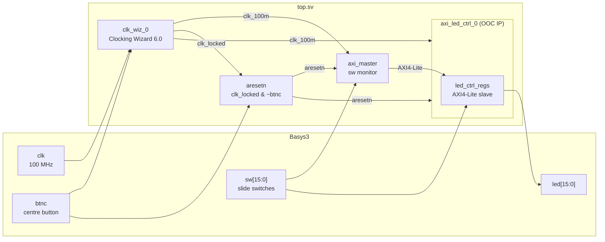
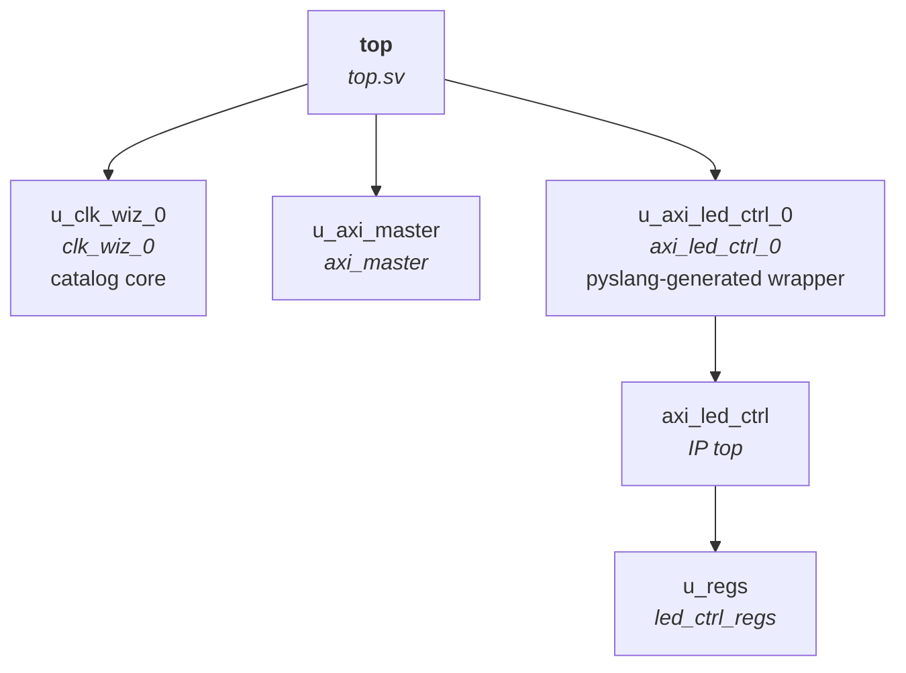
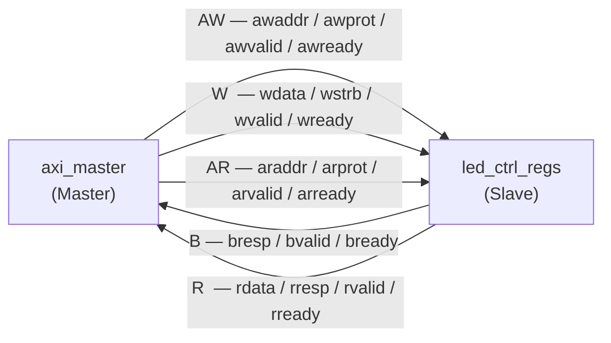
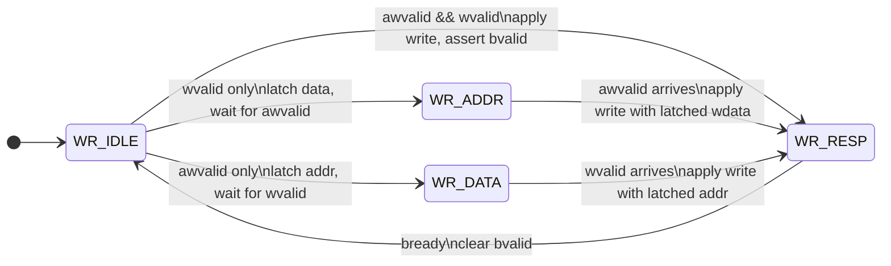
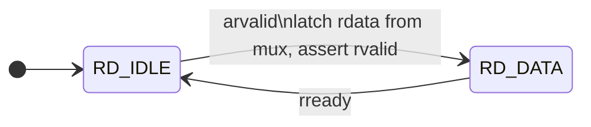
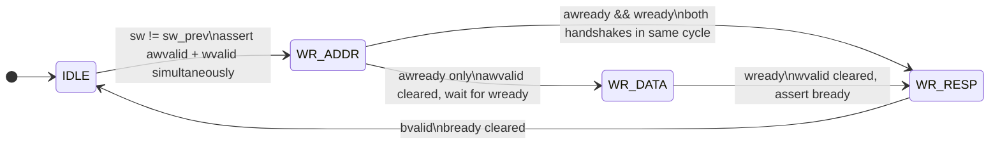
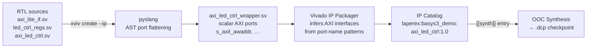
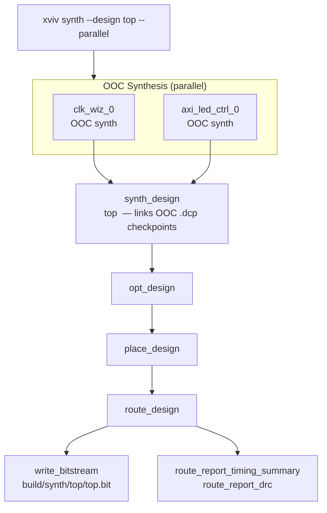

# design_axi_led

AXI4-Lite LED controller demo for the **Basys3** (`xc7a35tcpg236-1`).

A custom AXI4-Lite peripheral is packaged as a Vivado IP, OOC-synthesised, then instantiated alongside a Xilinx Clocking Wizard in a top-level design. An on-chip AXI master monitors the 16 slide-switches and writes their value to the LED register on every change — the LEDs mirror the switches entirely through AXI register writes over an internal bus.

Built and managed with [xviv](https://github.com/laperex/xviv).

---

## System architecture



---

## Project structure

```
design_axi_led/
├── project.toml              # xviv project config
├── constraints/
│   └── basys3.xdc            # pin assignments (LVCMOS33, false paths)
└── srcs/
    ├── rtl/
    │   ├── axi_lite_if.sv    # AXI4-Lite SV interface (master / slave modports)
    │   ├── led_ctrl_regs.sv  # register file — AXI4-Lite slave FSM
    │   ├── axi_led_ctrl.sv   # IP top (axi4_lite_if.slave port)
    │   ├── axi_master.sv     # on-chip master — writes sw on change
    │   └── top.sv            # Basys3 top: clk_wiz_0 + axi_led_ctrl_0
    └── sim/
        └── tb_axi_led_ctrl.sv  # IP-level testbench, 13 test cases
```

### Module hierarchy



---

## Register map

| Offset | Name | Access | Bits | Description |
|--------|------|--------|------|-------------|
| `0x00` | `LED_DATA` | R/W | `[15:0]` | Drives `led[15:0]` output |
| `0x04` | `SW_STATUS` | RO | `[15:0]` | Reflects `sw[15:0]`; writes ignored |

---

## AXI4-Lite bus

### Channel directions



### Write channel FSM (`led_ctrl_regs`)

Both AW and W channels may arrive simultaneously or in either order; the FSM handles all three cases.



> **Byte strobes** are honoured in all write paths: `wstrb[0]` gates `led[7:0]`, `wstrb[1]` gates `led[15:8]`. Writes to `SW_STATUS` (`0x04`) are silently discarded.

### Read channel FSM (`led_ctrl_regs`)



`rdata` mux: address `0x00` → `{16'h0, reg_led_data}` · address `0x04` → `{16'h0, sw}`.

### AXI master FSM (`axi_master`)



> AR/R channels are tied off (`arvalid = 0`, `rready = 1`); the master is write-only.

---

## Custom IP and wrapper generation


`axi_led_ctrl` uses a SystemVerilog interface port (`axi4_lite_if.slave s_axil`). Vivado's IP Packager cannot infer AXI bus interfaces from SV interface ports, so `[[wrapper]]` in `project.toml` instructs xviv to generate a flattened wrapper (`axi_led_ctrl_wrapper.sv`) via pyslang, exposing all AXI signals as scalar ports (`s_axil_awaddr`, `s_axil_wdata`, …). The wrapper is what gets packaged and instantiated as `axi_led_ctrl_0` in `top.sv`.



```sh
# Package the custom IP (generates wrapper, runs IP Packager)
xviv create --ip axi_led_ctrl

# Instantiate catalog cores
xviv create --core clk_wiz_0
xviv create --core axi_led_ctrl_0
```

---

## Constraint validation


`xviv validate` cross-references XDC pin assignments against RTL port declarations using Python's built-in Tcl engine and pyslang — no Vivado license needed. Useful as a fast CI gate before committing to a full synthesis run.

```sh
# Summary — total / constrained / unconstrained counts
xviv validate synth --design top --io short

# Full per-port table: PIN, IOSTANDARD, timing flags, status
xviv validate synth --design top --io full

# CI-friendly — exits non-zero if any port is unconstrained or unmatched
xviv validate synth --design top --io full --level error
```

---

## Synthesis


### Build flow



```sh
xviv synth --design top --parallel
```

Outputs in `build/synth/top/`:

```
top.bit
checkpoints/{synth,place,route}.dcp
reports/route_report_timing_summary_file.rpt
reports/route_report_drc_file.rpt
```

### Program

```sh
xviv program --bitstream build/synth/top/top.bit
```

### Incremental builds

```sh
# Resume from latest available checkpoint
xviv synth --design top --resume auto

# Only XDC changed — re-run write_bitstream only
xviv synth --design top --resume route

# RTL changed — re-run from opt onward
xviv synth --design top --resume synth
```

---

## Simulation


IP-level testbench (`xsim`, 13 test cases):

| TC | Description |
|----|-------------|
| TC01 | Post-reset `led` = `0` |
| TC02 | Combined AW+W write to `LED_DATA` (`0xDEAD`) |
| TC03 | Readback `LED_DATA` |
| TC04 | `SW_STATUS` passthrough (`sw = 0xA5C3`) |
| TC05 | Write to RO `SW_STATUS` — silently ignored |
| TC06 | Byte-strobe low byte (`wstrb = 4'h1`) |
| TC07 | Byte-strobe high byte (`wstrb = 4'h2`) |
| TC08 | AW-first split write |
| TC09 | W-first split write |
| TC10 | Three back-to-back sequential writes |
| TC11 | Write then immediate read (no idle gap) |
| TC12 | Live `sw` update reflected in `SW_STATUS` |
| TC13 | Mid-sim reset clears `LED_DATA` |

```sh
xviv simulate --target tb_axi_led_ctrl
xviv open --wdb tb_axi_led_ctrl
```

---

## Prerequisites

- Python ≥ 3.11
- Vivado 2024.1 or 2024.2

```sh
pip install xviv
```

Set the Vivado path in `.env` at the project root (add to `.gitignore`):

```sh
XVIV_VIVADO_SOURCE_SCRIPT=/tools/Xilinx/Vivado/2024.1/settings64.sh
```

---

## Regenerate demo GIFs

Requires [VHS](https://github.com/charmbracelet/vhs).

```sh
make        # renders all demo/*.gif
make clean  # removes generated GIFs
```